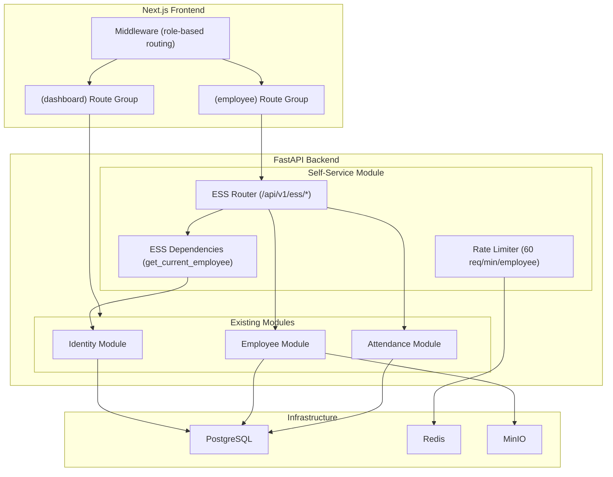
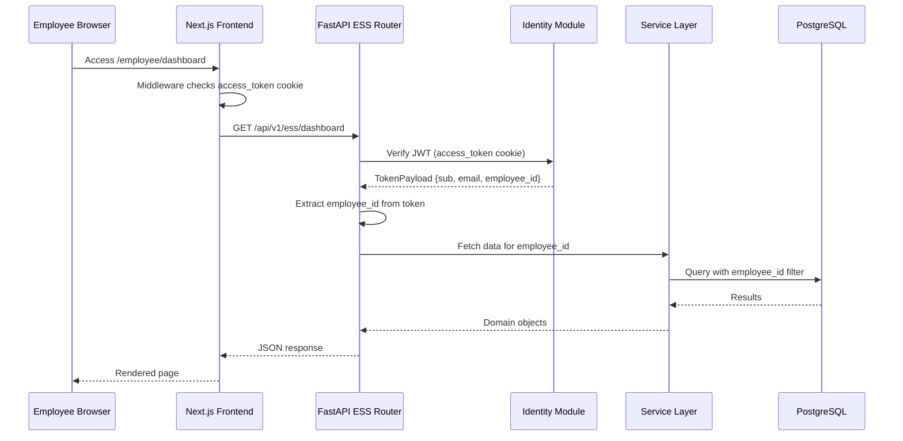
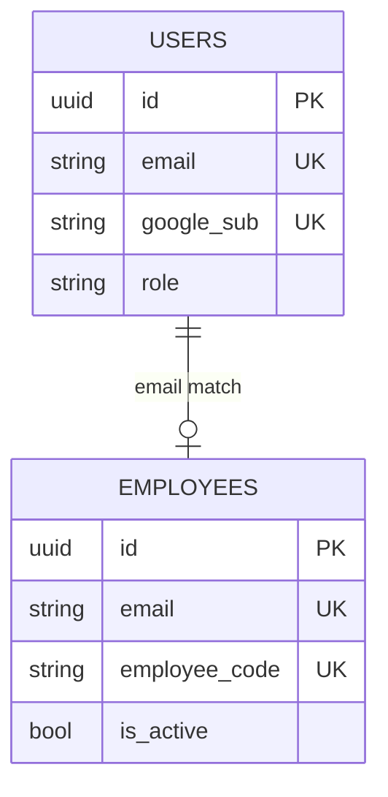

# Design Document: Employee Self-Service Portal

## Overview

The Employee Self-Service (ESS) Portal extends the existing VROOM HR system by introducing a new actor role — the **Employee** — who can directly interact with the system through dedicated self-service endpoints. Currently, all operations (attendance, leave, overtime) are HR-initiated. This feature adds a parallel set of employee-facing APIs and a dedicated frontend route group that enforces strict ownership-based access control.

### Key Design Decisions

1. **New module approach**: Create a dedicated `self_service` module in the backend rather than modifying existing HR-facing modules. This preserves the existing HR workflows while adding employee-facing endpoints with different authorization rules.

2. **User-Employee linking via email**: Leverage the existing `users.email` and `employees.email` fields to establish the link at login time. The `employee_id` is embedded in the JWT token claims, eliminating per-request database lookups for ownership verification.

3. **Reuse existing services**: The self-service module delegates to existing `AttendanceService`, `LeaveService`, `OvertimeService`, and `EmployeeService` for business logic, wrapping them with ownership guards.

4. **Frontend route group**: Add an `(employee)` route group in Next.js App Router, separate from the existing `(dashboard)` admin group, with its own layout and middleware checks.

## Architecture



### Request Flow



## Components and Interfaces

### Backend Components

#### 1. Self-Service Module (`src/modules/self_service/`)

```
src/modules/self_service/
├── __init__.py
├── container.py              # DI wiring for ESS dependencies
├── api/
│   ├── __init__.py
│   ├── router.py             # Main router aggregating sub-routers
│   ├── dependencies.py       # get_current_employee dependency
│   ├── schemas.py            # Pydantic request/response models
│   ├── profile_router.py     # Profile view/update endpoints
│   ├── attendance_router.py  # Check-in/out, history endpoints
│   ├── leave_router.py       # Leave requests, balances
│   ├── overtime_router.py    # Overtime requests
│   ├── document_router.py    # Document listing, download
│   ├── schedule_router.py    # Work schedule viewing
│   └── dashboard_router.py   # Dashboard aggregation endpoint
└── application/
    ├── __init__.py
    ├── ess_profile_service.py    # Profile view/update with field restrictions
    ├── ess_attendance_service.py # Self check-in/out with ownership guard
    ├── ess_leave_service.py      # Leave submission/cancellation for self
    ├── ess_overtime_service.py   # Overtime submission/cancellation for self
    └── ess_dashboard_service.py  # Dashboard data aggregation
```

#### 2. Identity Module Extensions

**Token Service Enhancement** — Add `employee_id` claim to JWT:

```python
# Modified create_access_token signature
def create_access_token(
    self, user_id: UUID, email: str, employee_id: UUID | None = None
) -> str:
    payload = {
        "sub": str(user_id),
        "email": email,
    }
    if employee_id:
        payload["employee_id"] = str(employee_id)
    expires_delta = timedelta(minutes=self._settings.access_token_expire_minutes)
    return self._jwt_utils.encode(payload, expires_delta)
```

**Auth Service Enhancement** — Resolve User-Employee link during login:

```python
# During OAuth callback, after user is resolved:
employee = await employee_repo.get_by_email(user.email)
employee_id = employee.id if employee and employee.is_active else None
access_token = token_service.create_access_token(user.id, user.email, employee_id)
```

#### 3. ESS Dependencies (`get_current_employee`)

```python
from uuid import UUID
from fastapi import HTTPException, Request, Depends
from src.modules.identity.container import get_token_service
from src.modules.identity.application.token_service import TokenService
from src.modules.identity.domain.exceptions import InvalidTokenError


async def get_current_employee(
    request: Request,
    token_service: TokenService = Depends(get_token_service),
) -> UUID:
    """Extract and validate employee_id from JWT token.

    Returns the employee_id UUID. Raises 403 if no employee link exists.
    """
    token = request.cookies.get("access_token")
    if not token:
        raise HTTPException(status_code=401, detail="Authentication required")

    try:
        payload = token_service.verify_access_token(token)
    except InvalidTokenError:
        raise HTTPException(status_code=401, detail="Invalid or expired token")

    # Extract employee_id from extended token payload
    raw = payload.extra.get("employee_id") if hasattr(payload, 'extra') else None
    if not raw:
        raise HTTPException(
            status_code=403,
            detail={"code": "NO_EMPLOYEE_LINK", "message": "No employee profile linked to this account"}
        )

    return UUID(raw)
```

### API Endpoints

| Method | Path                                        | Description                                               |
| ------ | ------------------------------------------- | --------------------------------------------------------- |
| GET    | `/api/v1/ess/profile`                       | View own profile                                          |
| PATCH  | `/api/v1/ess/profile`                       | Update allowed fields (phone, address, emergency_contact) |
| GET    | `/api/v1/ess/attendance/today`              | Get today's attendance status                             |
| POST   | `/api/v1/ess/attendance/check-in`           | Self check-in                                             |
| POST   | `/api/v1/ess/attendance/check-out`          | Self check-out                                            |
| GET    | `/api/v1/ess/attendance/history`            | Monthly attendance history                                |
| GET    | `/api/v1/ess/leave/balances`                | View leave balances                                       |
| GET    | `/api/v1/ess/leave/requests`                | List own leave requests                                   |
| POST   | `/api/v1/ess/leave/requests`                | Submit leave request                                      |
| POST   | `/api/v1/ess/leave/requests/{id}/cancel`    | Cancel pending leave request                              |
| GET    | `/api/v1/ess/overtime/requests`             | List own overtime requests                                |
| POST   | `/api/v1/ess/overtime/requests`             | Submit overtime request                                   |
| POST   | `/api/v1/ess/overtime/requests/{id}/cancel` | Cancel pending overtime request                           |
| GET    | `/api/v1/ess/documents`                     | List own documents                                        |
| GET    | `/api/v1/ess/documents/{id}/download`       | Get pre-signed download URL                               |
| GET    | `/api/v1/ess/schedule`                      | View own work schedule                                    |
| GET    | `/api/v1/ess/dashboard`                     | Dashboard aggregated data                                 |

### Frontend Components

```
frontend/src/app/(employee)/
├── layout.tsx                    # Employee layout (sidebar, nav)
├── page.tsx                      # Redirects to /employee/dashboard
├── dashboard/
│   └── page.tsx                  # Dashboard overview
├── profile/
│   └── page.tsx                  # Profile view/edit
├── attendance/
│   └── page.tsx                  # Attendance history + check-in/out
├── leave/
│   ├── page.tsx                  # Leave requests list
│   └── new/page.tsx              # Submit new leave request
├── overtime/
│   ├── page.tsx                  # Overtime requests list
│   └── new/page.tsx              # Submit new overtime request
├── documents/
│   └── page.tsx                  # Document list + download
└── schedule/
    └── page.tsx                  # Work schedule view
```

**Middleware Enhancement** — Route users based on role/employee link:

```typescript
// Enhanced middleware.ts
export function middleware(request: NextRequest) {
  const accessToken = request.cookies.get("access_token");
  if (!accessToken) {
    return NextResponse.redirect(new URL("/login", request.url));
  }

  const path = request.nextUrl.pathname;

  // Employee routes require employee_id in token
  if (path.startsWith("/employee")) {
    // Token validation happens server-side;
    // frontend relies on API 403 responses for access control
    return NextResponse.next();
  }

  return NextResponse.next();
}

export const config = {
  matcher: [
    "/((?!login|_next/|api/|favicon\\.ico|.*\\.(?:svg|png|jpg|jpeg|gif|webp|ico)$).*)",
  ],
};
```

## Data Models

### Existing Models (No Schema Changes Required)

The feature leverages existing database tables without schema modifications:

| Table                | Module     | Usage in ESS                      |
| -------------------- | ---------- | --------------------------------- |
| `users`              | Identity   | Authentication, email for linking |
| `employees`          | Employee   | Profile data, email for linking   |
| `employee_documents` | Employee   | Document listing and download     |
| `attendance_records` | Attendance | Check-in/out, history             |
| `leave_types`        | Attendance | Leave type reference              |
| `leave_balances`     | Attendance | Balance viewing                   |
| `leave_requests`     | Attendance | Leave submission/tracking         |
| `overtime_requests`  | Attendance | OT submission/tracking            |
| `work_schedules`     | Attendance | Schedule viewing                  |
| `holidays`           | Attendance | Holiday display                   |

### User-Employee Link Resolution

The link is resolved at login time by matching `users.email = employees.email`:



**No new join table is needed** — the email field serves as the natural link. The resolved `employee_id` is cached in the JWT token for the session duration.

### Pydantic Schemas (Key Models)

```python
# Profile Response (masks sensitive fields)
class ESSProfileResponse(BaseModel):
    full_name: str
    email: str
    phone: str | None
    date_of_birth: date | None
    gender: str | None
    address: str | None
    department_name: str | None
    position_name: str | None
    start_date: date | None
    contract_type: str | None
    id_number_masked: str | None  # "****1234"
    tax_code_masked: str | None   # "****5678"

# Profile Update (restricted fields only)
class ESSProfileUpdateRequest(BaseModel):
    phone: str | None = Field(None, pattern=r"^0\d{9}$")
    address: str | None = Field(None, max_length=500)
    emergency_contact: str | None = Field(None, max_length=255)

# Leave Request Submission
class ESSLeaveRequestCreate(BaseModel):
    leave_type_id: UUID
    start_date: date
    end_date: date
    reason: str | None = Field(None, max_length=500)

# Overtime Request Submission
class ESSOvertimeRequestCreate(BaseModel):
    work_date: date
    planned_hours: Decimal = Field(ge=Decimal("0.5"), le=Decimal("4.0"))
    reason: str = Field(max_length=500)

# Dashboard Response
class ESSDashboardResponse(BaseModel):
    today_attendance: AttendanceStatusEnum  # checked_in | not_checked_in | checked_out
    pending_leave_count: int
    pending_overtime_count: int
    monthly_summary: MonthlySummary
    annual_leave_remaining: Decimal | None
```

### Rate Limiting Key Structure

```
rate_limit:ess:{employee_id} → Redis sorted set (sliding window, 60 req/min)
```

Reuses the existing `RateLimiter` pattern but with a per-employee key instead of per-IP.

## Correctness Properties

_A property is a characteristic or behavior that should hold true across all valid executions of a system — essentially, a formal statement about what the system should do. Properties serve as the bridge between human-readable specifications and machine-verifiable correctness guarantees._

### Property 1: User-Employee Link Resolution

_For any_ user with email E and any employee with email E where the employee is active, the login process SHALL produce a JWT token containing that employee's ID. Conversely, for any user whose email does not match any active employee, the token SHALL NOT contain an employee_id claim.

**Validates: Requirements 1.1, 1.3**

### Property 2: Ownership Enforcement

_For any_ self-service API request where the token's employee_id is X and the target resource belongs to employee_id Y, the system SHALL grant access if and only if X == Y. When X ≠ Y, the system SHALL return a 403 status code.

**Validates: Requirements 1.4, 4.1, 4.5, 6.4, 7.3, 8.4, 9.1, 9.3, 12.1, 12.2**

### Property 3: Sensitive Field Masking

_For any_ string S of length N where N ≥ 4, the masking function SHALL produce a string where the first (N-4) characters are replaced with asterisks and the last 4 characters are preserved unchanged. For strings shorter than 4 characters, the entire string SHALL be masked.

**Validates: Requirements 2.2**

### Property 4: Response Field Completeness

_For any_ employee record, the profile response SHALL contain all required fields (full_name, email, phone, date_of_birth, gender, address, department_name, position_name, start_date, contract_type). For any attendance record, the response SHALL contain check_in, check_out, work_hours, overtime_hours, and status.

**Validates: Requirements 2.1, 4.3**

### Property 5: Profile Update Allowlist Enforcement

_For any_ profile update request containing a set of fields F, the system SHALL apply changes only for fields in the allowed set {phone, address, emergency_contact}. For any field in F that is not in the allowed set, the system SHALL either ignore it or reject the entire request with 403.

**Validates: Requirements 3.1, 3.3**

### Property 6: Vietnamese Phone Number Validation

_For any_ string S, the phone validation function SHALL accept S if and only if S matches the pattern `^0\d{9}$` (exactly 10 digits starting with 0). All other strings SHALL be rejected.

**Validates: Requirements 3.2**

### Property 7: Attendance Date Filter Consistency

_For any_ month M and year Y filter applied to attendance records, all returned records SHALL have a work_date within the range [first day of M/Y, last day of M/Y] inclusive.

**Validates: Requirements 4.2**

### Property 8: Monthly Summary Consistency

_For any_ set of attendance records R for a given month, the summary's total_work_days SHALL equal the count of records with status in {present, late, early_leave}, total_work_hours SHALL equal the sum of work_hours across all records, and total_overtime_hours SHALL equal the sum of overtime_hours across all records.

**Validates: Requirements 4.4, 11.3**

### Property 9: Check-in Idempotence

_For any_ employee who has already checked in on a given date, a subsequent check-in attempt on the same date SHALL be rejected and the original record SHALL remain unchanged.

**Validates: Requirements 5.2**

### Property 10: Work Hours Calculation

_For any_ check-in time T1 and check-out time T2 where T2 > T1, the calculated work_hours SHALL equal (T2 - T1) in hours minus break_minutes, with a minimum of 0. The result SHALL be non-negative.

**Validates: Requirements 5.3**

### Property 11: New Request Status Invariant

_For any_ newly created leave request or overtime request, the initial status SHALL always be "pending" regardless of the input parameters.

**Validates: Requirements 6.1, 8.1**

### Property 12: Leave Balance Enforcement

_For any_ leave request where the requested total_days exceeds the remaining_days for that leave type and year, the system SHALL reject the request. For any request where total_days ≤ remaining_days, the balance check SHALL pass.

**Validates: Requirements 6.3**

### Property 13: Cancellation State Machine

_For any_ leave request or overtime request, cancellation SHALL succeed if and only if the current status is "pending". For any request with status in {approved, rejected, cancelled}, cancellation SHALL be rejected.

**Validates: Requirements 6.5, 6.6, 8.5, 8.6**

### Property 14: Date Validation (No Past Dates)

_For any_ date D submitted as start_date (leave) or work_date (overtime), the system SHALL reject the request if D < today. The system SHALL accept D if D ≥ today. Additionally for leave requests, end_date SHALL not be before start_date.

**Validates: Requirements 6.7, 8.3**

### Property 15: Leave Balance Arithmetic Invariant

_For any_ leave balance record, the relationship remaining_days = total_days - used_days SHALL always hold. After any balance-modifying operation (deduction or restoration), this invariant SHALL be preserved.

**Validates: Requirements 7.1**

### Property 16: Planned Hours Range Validation

_For any_ decimal value H submitted as planned_hours in an overtime request, the system SHALL accept H if and only if 0.5 ≤ H ≤ 4.0.

**Validates: Requirements 8.2**

### Property 17: Document Type Filter Consistency

_For any_ document_type filter T applied to the document list, all returned documents SHALL have document_type equal to T.

**Validates: Requirements 9.4**

### Property 18: Dashboard Attendance Status Mapping

_For any_ employee on a given day: if no attendance record exists, the dashboard SHALL report "not_checked_in"; if a record exists with check_in but no check_out, the dashboard SHALL report "checked_in"; if a record exists with both check_in and check_out, the dashboard SHALL report "checked_out".

**Validates: Requirements 11.1**

### Property 19: Dashboard Pending Request Counts

_For any_ employee with a set of leave requests L and overtime requests O, the dashboard's pending_leave_count SHALL equal |{r ∈ L : r.status = "pending"}| and pending_overtime_count SHALL equal |{r ∈ O : r.status = "pending"}|.

**Validates: Requirements 11.2**

## Error Handling

### Error Response Format

All ESS endpoints follow the existing project convention:

```python
{
    "detail": {
        "code": "ERROR_CODE",
        "message": "Human-readable description"
    }
}
```

### Error Code Catalog

| Code                         | HTTP Status | Condition                                      |
| ---------------------------- | ----------- | ---------------------------------------------- |
| `NO_EMPLOYEE_LINK`           | 403         | JWT token has no employee_id claim             |
| `RESOURCE_FORBIDDEN`         | 403         | Attempting to access another employee's data   |
| `FIELD_UPDATE_FORBIDDEN`     | 403         | Attempting to modify restricted profile fields |
| `ALREADY_CHECKED_IN`         | 409         | Duplicate check-in on same date                |
| `NOT_CHECKED_IN`             | 409         | Check-out without prior check-in               |
| `ALREADY_CHECKED_OUT`        | 409         | Duplicate check-out on same date               |
| `INSUFFICIENT_LEAVE_BALANCE` | 422         | Leave days exceed remaining balance            |
| `INVALID_DATE_RANGE`         | 422         | start_date in past or end_date < start_date    |
| `INVALID_PLANNED_HOURS`      | 422         | planned_hours outside [0.5, 4.0]               |
| `INVALID_WORK_DATE`          | 422         | work_date in the past                          |
| `INVALID_STATUS_TRANSITION`  | 409         | Cancelling non-pending request                 |
| `RATE_LIMIT_EXCEEDED`        | 429         | More than 60 requests/minute                   |
| `INVALID_PHONE_FORMAT`       | 422         | Phone doesn't match Vietnamese format          |

### Error Handling Strategy

1. **Domain exceptions** in service layer are caught by the ESS error handler middleware and mapped to HTTP responses.
2. **Pydantic validation errors** are automatically returned as 422 by FastAPI.
3. **Unexpected errors** are caught at the router level, logged with full traceback, and returned as 500 with a generic message (no internal details exposed).
4. **Rate limit errors** are handled by middleware before reaching the route handler.

### Retry and Recovery

- Rate-limited requests return `Retry-After` header with seconds until the window resets.
- Pre-signed URL generation failures (MinIO unavailable) return 503 with retry guidance.
- Database connection failures trigger automatic retry via SQLAlchemy's connection pool.

## Testing Strategy

### Property-Based Testing

This feature is suitable for property-based testing due to its pure validation logic, data transformation functions, and state machine transitions.

**Library**: [Hypothesis](https://hypothesis.readthedocs.io/) (Python)

**Configuration**:

- Minimum 100 examples per property test
- Deadline: 500ms per example
- Database: `hypothesis.database.DirectoryBasedExampleDatabase`

**Tag format**: `# Feature: employee-self-service, Property {N}: {title}`

Each correctness property (1–19) maps to a single property-based test in `backend/tests/property/test_ess_properties.py`.

### Unit Tests

Focus areas (example-based):

- Login flow with/without employee link (Requirements 1.2, 12.5)
- Profile update timestamp recording (Requirement 3.4)
- Check-in creates record with correct timestamp (Requirement 5.1)
- Check-out without check-in error (Requirement 5.4)
- Leave balance display grouped by type (Requirement 7.2)
- Work schedule lookup (Requirements 10.1, 10.2, 10.3)
- Dashboard annual leave balance (Requirement 11.4)
- Pre-signed URL generation with 15-min expiry (Requirement 9.2)

### Integration Tests

- Rate limiting at 60 req/min threshold (Requirement 12.3)
- Audit log creation for ESS operations (Requirement 12.4)
- Response time under 500ms for profile (Requirement 2.3)
- Response time under 1000ms for dashboard (Requirement 11.5)
- MinIO pre-signed URL generation end-to-end (Requirement 9.2)

### Test Organization

```
backend/tests/
├── property/
│   └── test_ess_properties.py    # All 19 property-based tests
├── unit/
│   └── test_ess/
│       ├── test_profile_service.py
│       ├── test_attendance_service.py
│       ├── test_leave_service.py
│       ├── test_overtime_service.py
│       └── test_masking.py
└── integration/
    └── test_ess/
        ├── test_ess_endpoints.py
        ├── test_rate_limiting.py
        └── test_audit_logging.py
```

### Frontend Testing

- Component tests with React Testing Library for each page
- API mocking with MSW (Mock Service Worker)
- E2E tests with Playwright for critical flows (login → dashboard → check-in)
