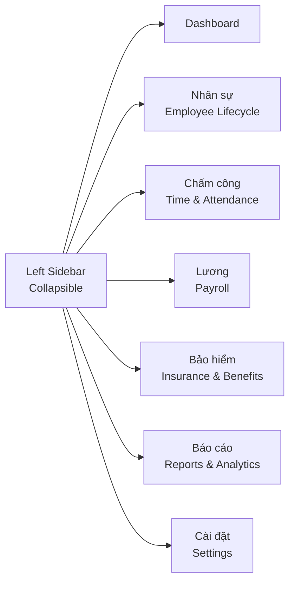

# UI/UX Design References for Vroom HR

> Phân tích UI/UX của các HR platform hàng đầu thế giới và đề xuất design direction cho Vroom HR — nền tảng HR dành cho doanh nghiệp Việt Nam.

---

## Mục lục

1. [Tổng quan thị trường](#1-tổng-quan-thị-trường)
2. [Phân tích từng nền tảng](#2-phân-ích-từng-nền-tảng)
   - [Rippling](#rippling)
   - [BambooHR](#bamboohr)
   - [Personio](#personio)
   - [Deel](#deel)
   - [Remote](#remote)
   - [Oyster HR](#oyster-hr)
   - [Lattice](#lattice)
   - [Gusto](#gusto)
   - [Knoetic](#knoetic)
3. [So sánh chiều thiết kế](#3-so-sánh-chiều-thiết-kế)
   - [Layout & Sidebar](#31-layout--sidebar)
   - [Color Palette](#32-color-palette)
   - [Typography](#33-typography)
   - [Card Design](#34-card-design)
   - [Data Table](#35-data-table)
   - [Dashboard](#36-dashboard)
4. [Design Patterns chung](#4-design-patterns-chung)
5. [Đề xuất Design Direction cho Vroom HR](#5-đề-xuất-design-direction-cho-vroom-hr)

---

## 1. Tổng quan thị trường

HR SaaS UI là một trong những thể loại UI phức tạp nhất trong enterprise software vì:

- **Three-audience problem**: Cùng một sản phẩm phải phục vụ employee (dùng không thường xuyên), HR admin (dùng hàng ngày), và executive (cần aggregated data).
- **Compliance complexity**: Mọi workflow liên quan đến lương, thuế, bảo hiểm đều có hậu quả pháp lý.
- **Data sensitivity**: Lương, performance reviews, thông tin sức khỏe — tất cả đều là dữ liệu nhạy cảm.

Các platform hàng đầu giải quyết bài toán này bằng:
1. **Role-based views** — hiển thị khác nhau cho admin, manager, employee
2. **Progressive disclosure** — giấu complexity đằng sau plain-language copy
3. **Lifecycle navigation** — tổ chức navigation theo hành trình employee, không phải tính năng

---

## 2. Phân tích từng nền tảng

### Rippling

| Khía cạnh | Chi tiết |
|-----------|----------|
| **Vị thế** | All-in-one HR + IT + Finance, valuation $11.25B (2022) |
| **Target** | SME 50–1000 employees, high-growth tech |

#### Layout & Navigation
- **Left sidebar** làm navigation chính, collapsible (icon-only khi thu gọn)
- 3 tab top-level ngang hàng: **HR, IT, Finance** — phản ánh unified product strategy
- Mỗi department có "home" riêng, không module phụ trong sidebar
- Universal search bar với natural language processing

#### Color Palette
```
- Primary:       #ffa81d (amber/orange) — signature CTA
- Surface:       #ffffff (trắng)
- Surface-alt:   #000000 (đen — dark mode)
- Ink:           #000000
- Ink-secondary: #3d3331
- Ink-muted:     #756b67
- Ink-warm:      #cec1b8
- Border:        #e1d8d2 (warm tint)
- Border-subtle: #e5e7eb
- Success:       #22c55e
- Warning:       #f59e0b
- Error:         #ef4444
- Info:          #3b82f6
```

#### Typography
- **Display**: Basel (custom sans-serif) — medium weight
- **UI/Buttons**: Plus Jakarta Sans
- Modular scale rõ ràng: display → heading-section → heading-sub → title

#### Design DNA
- **"Black-canvas HR/IT platform"**: Nền trắng clinical + warm-toned borders + amber CTA
- Corner radius: 4–8px
- Data visualization ưu tiên clarity over complexity
- Customizable dashboard với widget-based layout
- Interactive org chart với drag-and-drop

#### Standout UI Elements
- Unified employee database — single source of truth
- Automated workflow onboarding/offboarding
- One-click payroll compliance checks

---

### BambooHR

| Khía cạnh | Chi tiết |
|-----------|----------|
| **Vị thế** | HRIS cho SME, tập trung vào employee experience |
| **Design philosophy** | "Human Design for HR" — friendly, warm, trustworthy |

#### Layout & Navigation
- **Left sidebar** (chuyển từ top nav năm 2024)
- Navigation tổ chức theo **employee lifecycle**: Hiring → Onboarding → Compensation → Culture → Time & Attendance
- Không tổ chức theo feature-module truyền thống
- Subnavigation chiếm ít vertical space

#### Color Palette
```
- Primary:       #bcdc44 (lime green) — signature BambooHR green
- Primary-light: #d0e395
```
- Hỗ trợ **color customization** — khách hàng đổi màu theo brand riêng

#### Typography
- **Headline**: Fields (Adam Ladd) — rounded serif, thick, sturdy
  - "friendly, warm, inviting, not childish"
  - Rounded serifs, teardrop terminals, subtle tails
  - Retro aesthetic nhưng không indulgent
- **Body**: Sans-serif hiện đại, clean

#### Design DNA
- **"The best interface is one that people don't notice"**
- Rounded corners, rounded buttons
- Nhiều negative space — "airy and spacey" — approachable
- Microcopy có personality: friendly, colloquial, không robot
- Icons unified từ một font family

#### Key Design Decisions
- **Rounded corners**: User preference testing cho thấy được ưa chuộng
- **Subnavigation dọc**: Tiết kiệm vertical space, sẵn sàng mở rộng
- **Warmth + maturity**: "not stodgy, but not something I'd feel uncomfortable putting my Social Security number into"

---

### Personio

| Khía cạnh | Chi tiết |
|-----------|----------|
| **Vị thế** | Intelligent HR platform cho European mid-market |
| **Target** | DACH + EU, 50–2000 employees |

#### Layout & Navigation
- Modern redesign (2024) — "reimagined, redesigned Personio"
- Central inbox experience cho HR workflows
- Analytics area với metrics dashboard

#### Design System
- **@highlight-ui** design system (open source trên npm)
  - `@highlight-ui/typography`
  - `@highlight-ui/color-picker`
- Component-based: product components, color system, typography, iconography, illustration, animation, motion

#### Design DNA
- Cohesive visual language giữa product và marketing
- Brand-first approach: brand strategy → tone of voice → web copy → product UI
- In-house rebrand (Paul Jun-led) — unified product, marketing, sales, employer brand
- Kết quả: NPS tăng double-digit, webinar attendance tăng 40%

---

### Deel

| Khía cạnh | Chi tiết |
|-----------|----------|
| **Vị thế** | Global HR + payroll, 150+ countries, valuation $12B |
| **Target** | Distributed companies hiring globally |

#### Layout & Navigation
- **Global-first UI**: Country flags, local currency labels, jurisdiction-specific compliance notices là first-class UI elements
- Dashboard clean và intuitive
- Contract creation guided và clear

#### Color Palette
```
- Primary:       #FFE27C (warm yellow) — signature accent
- Text/primary:  #faf4ee (warm white)
- Accent:        #5938b7 (deep purple)
- Surface/bg:    #d8ebff (light blue)
```

#### Typography
- Modern sans-serif
- Display: 2.8rem / 700
- Headings: 2rem / 700 → 1.5rem / 600 → 1.125rem / 600
- Body: 1rem / 400
- Caption: 0.75rem / 400
- Monospace: cho code/compliance elements

#### Design System Tokens
```
Spacing: 4px → 8px → 12px → 16px → 24px → 32px → 48px → 64px
Radius: none(0) → sm(4px) → md(8px) → lg(16px) → xl(24px) → full(9999px)
```

#### Design DNA
- **"UX-first" approach** — design là growth strategy, không phải embellishment
- Mask complexity với simplicity
- Onboarding flows streamlined
- Rapid feedback loops trong YC — weekly product reviews, UX bottleneck identification
- Kết quả: 100+ customers trong YC batch, gần $1M ARR

#### Standout Features
- Inline compliance context (không phải dropdown 3 levels deep)
- Country/jurisdiction là first-class UI data
- Analytics 2.0 với custom reports

---

### Remote

| Khía cạnh | Chi tiết |
|-----------|----------|
| **Vị thế** | Global HR platform cho distributed teams |
| **Target** | Remote-first companies |

#### Layout & Navigation
- **Left sidebar** persistent
- Modular cards và panels organize features (onboarding, payroll, documentation)
- Dashboard structure (không marketing site sections)

#### Color Palette
```
- Primary:       #624de3 (royal purple)
- Dark:          #00234b (prussian navy)
- Accent:        #75e8f0 (spray/teal)
- White:         #ffffff
```

#### Typography
- Modern sans-serif, highly legible
- Bold headings → lighter body text
- Clean hierarchy

#### Design DNA
- **"Sleek, professional minimalism"**
- Whitespace để guide attention
- Muted backgrounds + vibrant accent colors
- Trust, sophistication, reliability
- Icons + subtle illustrations (minimal, purposeful)
- Status chips, avatars, concise data charts

#### EOR Complexity Abstraction
- Country-selection step → tự động sinh local employment contract
- Benefits package + compliance checklist per country
- Guided process với clear status states

---

### Oyster HR

| Khía cạnh | Chi tiết |
|-----------|----------|
| **Vị thế** | Global employment platform, EOR, 180+ countries |
| **Target** | Distributed companies, remote teams |

#### Color Palette
```
- Dark Gray:     #323232 (primary brand color)
- Teal:          (primary UI accent — xanh dương/teal chủ đạo)
- 8 official brand colors total
```
- Teal brand reflects openness, global reach

#### Design DNA
- Clean, credible
- "Optimism of remote work + credibility of compliance"
- Webflow Awards finalist for homepage
- Brand system across campaigns, web, editorial, presentations

---

### Lattice

| Khía cạnh | Chi tiết |
|-----------|----------|
| **Vị thế** | People management + performance |
| **Target** | Mid-market, people-first companies |

#### Layout & Navigation
- **"Elevated Design"** — major redesign
- **Discovery Navigation** — surfaces information và workflows để navigate nhanh
- **Home page** là basecamp: 1:1s, feedback, reviews
- **People tab** — centers tools trong context của people connections
- **Performance Toolkit** — reviews, 1:1s, growth trong một view

#### Design DNA
- **"Make work meaningful"** — mission-driven design
- Performance cycle visualized as continuous loop (không isolated events)
- Manager experience: My Team page refocuses on direct reports
  - Team performance dashboard, sentiment over time
  - Proactive support actions

#### UI Patterns
- Dashboard với metrics và charts
- Side navigation panel
- Data input forms, validation and submission
- Settings and configuration page
- Analytics và data visualization
- Light tones palette

---

### Gusto

| Khía cạnh | Chi tiết |
|-----------|----------|
| **Vị thế** | Payroll + benefits cho small business |
| **Target** | US small business, < 100 employees |

#### Design DNA
- **Wizard-based flows** cho mọi high-stakes HR workflow
- Step-by-step: mỗi step chỉ surface thông tin cần cho 1 decision
- Plain-language copy giải thích *tại sao* quan trọng
- Progress indicator luôn hiển thị
- Ví dụ: first-time employee setup W-4 không cần hiểu W-4 là gì

---

### Knoetic

| Khía cạnh | Chi tiết |
|-----------|----------|
| **Vị thế** | People analytics platform |
| **Target** | CHRO, people analytics teams |

#### Design DNA
- **Analytics-first**: Charts là default view khi login
- Headcount trends, attrition rates, diversity metrics, compensation bands
- "A product that defaults to charts communicates HR as analytics"
- Employee directory là secondary view

---

## 3. So sánh chiều thiết kế

### 3.1 Layout & Sidebar

| Platform | Sidebar Style | Navigation Model | Notable |
|----------|---------------|------------------|---------|
| **Rippling** | Collapsible left (icon → expanded) | Department tabs (HR/IT/Finance) | Unified nav, modular |
| **BambooHR** | Left sidebar (chuyển từ top 2024) | Employee lifecycle stages | Subnav dọc |
| **Deel** | Left sidebar | Global-first, country context | Context inline |
| **Remote** | Left sidebar persistent | Dashboard sections | Modular cards |
| **Lattice** | Left sidebar + Discovery Nav | Role-switching (IC/manager/admin) | People-centric |
| **Gusto** | Top nav + wizard flows | Task-based | Wizard chiếm focus |

**Trend**: **Collapsible left sidebar** là chuẩn ngành. Top nav đang bị loại bỏ dần.

### 3.2 Color Palette

| Platform | Primary | Accent | Tone | Mood |
|----------|---------|--------|------|------|
| **Rippling** | Amber `#ffa81d` | Warm neutrals | Black/white canvas | Premium, confident |
| **BambooHR** | Lime `#bcdc44` | — | Customer-customizable | Friendly, warm |
| **Deel** | Yellow `#FFE27C` | Purple `#5938b7` | Warm white `#faf4ee` | Bold, global |
| **Remote** | Purple `#624de3` | Teal `#75e8f0` | Navy `#00234b` | Trustworthy, calm |
| **Oyster** | Teal | Dark gray `#323232` | — | Open, credible |

**Trend**: 
- **Warm, approachable tones** đang thay thế corporate blue truyền thống
- **Dark mode** ngày càng phổ biến cho power users
- Color customization là feature (BambooHR cho customer tự đổi màu)

### 3.3 Typography

| Platform | Headline Font | Body Font | Character |
|-----------|---------------|-----------|-----------|
| **Rippling** | Basel (custom sans) | Plus Jakarta Sans | Clean, modern, medium weight |
| **BambooHR** | Fields (rounded serif) | Sans-serif | Warm, friendly, distinctive |
| **Deel** | Modern sans-serif | Modern sans-serif | Professional, clean |
| **Remote** | Modern sans-serif | Modern sans-serif | Legible, balanced |

**Trend**:
- **Custom fonts** đang là differentiation factor (Rippling's Basel, BambooHR's Fields)
- Modular typography scale rõ ràng
- Sans-serif là chủ đạo, serif xuất hiện ở brand/display contexts

### 3.4 Card Design

| Approach | Examples | Details |
|----------|----------|---------|
| **Modular cards** | Remote, Rippling | Widget-based, draggable, customizable |
| **Dashboard widgets** | Lattice, Rippling | KPI cards with micro-charts |
| **Profile cards** | Lattice People tab | Name, title, department, contact inline |
| **Status chips** | Remote, Deel | Visual cues inline in cards |

**Pattern**: Cards với border-radius 4–16px, shadow nhẹ, whitespace generous.

### 3.5 Data Table

| Platform | Characteristics |
|----------|-----------------|
| **Rippling** | Dense nhưng scannable, expandable rows, bulk checkbox |
| **BambooHR** | Employee lifecycle view, compact mode |
| **Deel** | Country/jurisdiction columns inline, compliance status |
| **Lattice** | Performance data integrated, sortable/filterable |

**Best practices** từ research:
- Compact row heights cho scanning, expandable cho detail
- Bulk actions: checkbox column + action bar trên selection
- Smart filters with persistence (saved filter sets)
- Multi-audience: admin thấy dense, employee thấy simplified

### 3.6 Dashboard

| Platform | Default View | Widget Style |
|----------|-------------|--------------|
| **Rippling** | Customizable, widget-based | KPI cards, charts, activity feed |
| **Lattice** | Home basecamp + My Team | Performance metrics, sentiment |
| **Knoetic** | Charts-first | Headcount, attrition, comp bands |
| **Remote** | Onboarding + payroll panels | Modular, scannable sections |

**Trend**: Operational dashboard — không chỉ show data mà còn suggest "next best action".

---

## 4. Design Patterns chung

### 4.1 Multi-Audience Navigation
- **Role-based default views** (Rippling's department tabs, Lattice's manager/IC toggle)
- Contextual navigation theo active workflow (BambooHR lifecycle)
- Explicit role-switching trong cùng product

### 4.2 Compliance Handling
- **Progressive disclosure**: Surface chỉ information cần tại decision moment
- **Plain-language copy**: Giải thích *why*, không chỉ *what*
- **Inline context**: Country flags, jurisdiction notices (Deel, Remote)
- **Guardrails, not dead-ends**: Errors như guide, không phải block

### 4.3 Employee Self-Service
- Task-oriented navigation: "Check my pay", "Request time off"
- One thing per page
- Mobile-first cho employee tasks
- Wizard flows cho complex processes (Gusto)

### 4.4 Notification Design
- **Actionable notifications**: Approve/deny từ notification
- Role-based routing: PTO → direct manager, compliance → HR admin
- Granular preference settings

### 4.5 Sensitive Data UX
- Masked fields (SSN, bank accounts) với reveal action
- Role-based visibility controls
- Export confirmation + audit trail

---

## 5. Đề xuất Design Direction cho Vroom HR

### 5.1 Design Principles

```
1. Vietnamese-first, globally-capable
   ─────────────────────────────────
   Không dịch từ UI phương Tây. Thiết kế cho:
   - Workflow văn phòng chính thức (hợp đồng lao động, BHXH, thuế TNCN)
   - Văn hóa doanh nghiệp Việt Nam
   - Quy định pháp luật Việt Nam

2. Warm professionalism
   ─────────────────────
   Giữa "thân thiện" và "chuyên nghiệp":
   - Ấm áp như BambooHR
   - Tin cậy như Rippling
   - Phù hợp cho cả startup và doanh nghiệp truyền thống

3. Progressive disclosure
   ───────────────────────
   Luật lao động Việt Nam phức tạp:
   - BHXH, BHYT, BHTN, thuế TNCN theo bậc
   - Hợp đồng thử việc, hợp đồng chính thức, thỏa ước lao động tập thể
   UI cần guide, không overwhelm.

4. Dual-user excellence
   ─────────────────────
   - HR Admin: Power tools, bulk operations, data density
   - Employee: Simple, task-oriented, mobile-friendly
```

### 5.2 Layout & Navigation



- **Collapsible left sidebar** — icon-only khi thu gọn, expanded khi cần
- **Lifecycle navigation** — Tuyển dụng → Onboarding → Hợp đồng → Chấm công → Lương → Bảo hiểm → Đánh giá → Nghỉ việc
- **Role switcher** — Admin / Manager / Employee

### 5.3 Color Palette (Đề xuất)

Màu sắc dựa trên văn hóa Việt Nam — **đỏ và vàng** là màu quốc gia, nhưng HR cần sự tin cậy và chuyên nghiệp.

```
Primary:       #C62828  (đỏ Việt Nam — đậm, chuyên nghiệp)
Primary-alt:   #1565C0  (xanh dương — tin cậy, cho module khác)
Secondary:     #FF8F00  (vàng/hổ phách — highlight, accent)
Success:       #2E7D32  (xanh lá — completed)
Warning:       #F57C00  (cam — attention)
Error:         #D32F2F  (đỏ — error)
Info:          #0288D1  (xanh dương nhạt — information)

Surface bg:    #FAFAFA  (xám nhẹ, dễ chịu hơn trắng tinh)
Surface card:  #FFFFFF  (trắng cho card)
Border:        #E0E0E0  (xám nhạt)
Border-focus:  #C62828  (đỏ chủ đạo cho focus)

Text primary:  #212121  (gần đen)
Text secondary: #616161 (xám)
Text disabled: #9E9E9E  (xám nhạt)
```

**Giải thích**:
- **Đỏ `#C62828`**: Màu chủ đạo — tượng trưng cho may mắn, nhiệt huyết trong văn hóa Việt, nhưng tone đậm để giữ sự chuyên nghiệp
- **Vàng/hổ phách `#FF8F00`**: Accent — tượng trưng cho thịnh vượng, dùng cho CTA, nổi bật
- **Xanh dương `#1565C0`**: Secondary — truyền thống tin cậy cho HR, dùng cho module phụ

### 5.4 Typography (Đề xuất)

**Headline font**: **Be Vietnam Pro** (Google Fonts — hỗ trợ tiếng Việt đầy đủ diacritics)
- Hoặc **SVN-Gilroy** nếu muốn custom font Việt Nam
- Weight: 600–700 cho headings

**Body font**: **Inter** hoặc **Nunito**
- Inter: professional, clean, hỗ trợ tiếng Việt tốt
- Nunito: mềm mại, thân thiện hơn — phù hợp employee-facing UI

**Scale**:
```
Display:  2.5rem  (40px) / 700
H1:       2rem    (32px) / 600
H2:       1.5rem  (24px) / 600
H3:       1.25rem (20px) / 600
Body:     1rem    (16px) / 400
Small:    0.875rem (14px) / 400
Caption:  0.75rem (12px) / 400
```

### 5.5 Components

#### Cards
- Border-radius: **8px** (sweet spot giữa hiện đại và chuyên nghiệp)
- Shadow: subtle elevation (box-shadow: 0 1px 3px rgba(0,0,0,0.08))
- Hover: nhẹ nhàng nâng elevation
- KPI cards với micro-chart + trend indicator

#### Data Table
- **Compact mode** cho admin (row height 40px)
- **Expanded mode** cho detail view
- Checkbox column + bulk action bar
- Filters: multi-condition, saved filters, persistent state
- Số liệu Việt Nam: dấu phân cách hàng nghìn `.`, thập phân `,`
- Format tiền tệ: `₫`, `VNĐ`

#### Forms
- Label ở trên, không placeholder-as-label
- Validation inline, real-time
- Progressive disclosure cho complex forms (BHXH, thuế)
- Wizard cho multi-step (onboarding, hợp đồng)

#### Dashboard
- **Admin dashboard**: KPI cards (headcount, biến động, đang tuyển), chart, activity feed, pending approvals
- **Manager dashboard**: Team overview, PTO calendar, pending reviews
- **Employee dashboard**: Payslip quick view, PTO balance, tasks, company announcements

### 5.6 Vietnamese Localization Design Considerations

| Yếu tố | Thiết kế |
|--------|----------|
| **Tiếng Việt diacritics** | Font hỗ trợ đầy đủ: Be Vietnam Pro, Inter, Nunito |
| **Tên người Việt** | Field đủ rộng cho tên đầy đủ (Nguyễn Văn A) |
| **Địa chỉ Việt Nam** | Form theo cấu trúc: Số nhà → Đường → Phường/Xã → Quận/Huyện → Tỉnh/Thành phố |
| **Số điện thoại** | Format: +84 xxx xxx xxxx, support 10 số |
| **Tiền tệ** | VND format: `1.234.567 ₫` |
| **Ngày tháng** | Format: DD/MM/YYYY (chuẩn Việt Nam) |
| **BHXH/BHYT/BHTN** | Progressive disclosure — giải thích từng khoản trích |
| **Thuế TNCN** | Wizard-guided — người dùng không cần hiểu biểu thuế lũy tiến |
| **Hợp đồng lao động** | Template theo Luật Lao động 2019, guided creation |

### 5.7 Design System Roadmap

```
Phase 1: Foundation
├── Color tokens
├── Typography scale
├── Spacing scale (4px base)
├── Border radius + shadow tokens
└── Icon set (Material + custom HR icons)

Phase 2: Core Components
├── Button system (primary/secondary/ghost/danger)
├── Form controls (input, select, datepicker, upload)
├── Data table (sort, filter, bulk action, pagination)
├── Card (KPI, profile, stats)
├── Sidebar (collapsible, nested, icon + label)
├── Modal / Drawer
├── Toast / Notification
└── Tabs / Stepper

Phase 3: HR-Specific Components
├── Org chart (tree + directory mode)
├── Employee profile card
├── PTO calendar
├── Payroll summary table
├── Onboarding checklist
├── Approval workflow (multi-step with status)
└── Report builder (drag-drop metrics)

Phase 4: Theming & Customization
├── Light / Dark mode
├── Company branding (logo, primary color)
└── White-label option
```

### 5.8 Tổng kết: Vroom HR Design Direction

| Chiều | Direction | Inspired by |
|-------|-----------|-------------|
| **Tone** | Warm professionalism | BambooHR + Rippling |
| **Layout** | Collapsible left sidebar, lifecycle nav | BambooHR, Remote |
| **Color** | Đỏ Việt Nam + vàng accent | Cultural identity + Rippling's amber |
| **Typography** | Be Vietnam Pro / Inter | Modern, Vietnamese-first |
| **Cards** | 8px radius, subtle shadow | Remote, Lattice |
| **Tables** | Dense + expandable, bulk actions | Rippling |
| **Dashboard** | Role-based, operational | Rippling + Lattice |
| **Forms** | Wizard + progressive disclosure | Gusto, Deel |
| **Compliance** | Inline context, plain language | Deel, Remote, Gusto |
| **Mobile** | Task-oriented, employee-facing | BambooHR employee portal |

---

## References

### Articles & Teardowns
1. [Rippling Product Teardown — NextSprints](https://nextsprints.com/guide/rippling-product-teardown-analysis)
2. [BambooHR: A Human Design for HR — Behind the Scenes UI 2024](https://www.bamboohr.com/resources/ebooks/behind-the-scenes-ui-2024)
3. [Personio Redesign — Creating Modern HR Experiences](https://www.personio.com/blog/creating-modern-hr-experiences-personio-redesign/)
4. [Lattice Elevated Design — Unveiling Lattice's Redesign](https://lattice.com/blog/unveiling-lattices-elevated-design)
5. [Deel's UX-First Approach — Foundey Case Study](https://foundey.com/blog/deel-s-ux-first-approach-secured-early-product-market-fit)
6. [HR & Payroll SaaS UI: 16 Products Analyzed — SaaS Boat](https://saasboat.com/hr-payroll-saas-ui-examples-16-products-analyzed/)
7. [HR SaaS UI Design: Patterns for People Operations — DesignPixil](https://designpixil.com/blog/hr-saas-ui-design)
8. [SaaS Dashboard Design: 2026 Trends & Patterns — SaaSFrame](https://www.saasframe.io/blog/the-anatomy-of-high-performance-saas-dashboard-design-2026-trends-patterns)
9. [Why HR Software Design Matters — Lattice](https://lattice.com/library/why-hr-software-design-matters)

### Design Systems & Colors
10. [Rippling Design System — designmd](https://designmd.santiagoalonso.com/rippling)
11. [Rippling Brand Guide — Rippling In-House Rebrand](https://www.rippling.com/blog/how-we-pulled-off-an-in-house-rebrand-in-four-months)
12. [Deel Design System — DesignMD](https://designmd.directory/p/deel-design-md)
13. [Deel Brand Colors — ColorFYI](https://colorfyi.com/brands/deel-inc/)
14. [Remote Brand Colors — Mobbin](https://mobbin.com/colors/brand/remote-technology)
15. [Oyster Brand Colors — ColorFYI](https://colorfyi.com/brands/oyster-hr/)
16. [iNET Design System (Việt Nam) — ViUI](https://viui.inet.vn/)
17. [Remote Dashboard Design — SaaSFrame](https://www.saasframe.io/examples/remote-dashboard)

### Vietnamese Design Context
18. [Designing a System Typeface That Speaks Vietnamese](https://lambao.medium.com/designing-a-system-typeface-that-speaks-vietnamese-19d3bc61b124)
19. [Huong: Designing a Vietnamese Typeface — AUT Link Praxis](https://ojs.aut.ac.nz/link-praxis/article/view/34)
20. [UI/UX Design in Vietnam — Lollypop Design](https://lollypop.design/ui-ux-design-agency-vietnam/)
